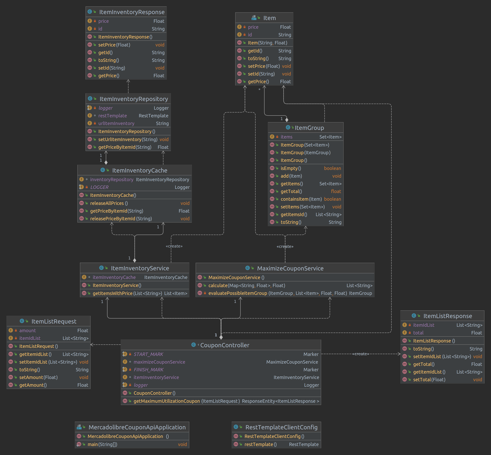

# Análisis del problema y Diseño de solución

En este documento se describe el proceso de analisis del problema y el diseño realizado.

## Funcionalidad de maximización de uso del cupón

En primera instancia se considera el problema de optimización que busca maximizar el total gastado, con limite en el valor total del cupón, por un grupo de items. Donde el item _i_ con precio _pi_ del conjunto de _N_ items, puede estar incluido unicamente una sola vez _xi_. Por lo cual este problema se puede representar mediante la siguiente expresión:

A partir de lo cual se puede asociar este problema como una variante del problema de la mochila (_knapsack problem_ en inglés).

Por una parte, teniendo en consideración que los usuarios pueden tener una cantidad significativa de items como favoritos, de acuerdo a lo descrita en el enunciado "... Hay usuarios que tienen miles de items en favoritos..." del requerimiento. Y su vez, la cantidad de items que permite el cupon es significativamente menor en comparación al número de items. Por lo cual, para estos casos el espacio de búsqueda es significativamente mayor al necesario para obtener la solución, y en consecuencia, se plantea el uso de un algoritmo hibrido combinando programación dinamica Top-Down, y ramificación y poda. 

Con lo cual, se plantea el siguiente algoritmo:

...

## Diagrama de clases

Se plantean las siguientes clases y en particular para el modelo de dominio:

- Clase __Item__: Modela el item con su precio.
- Clase __ItemGroup__:Modela a un grupo de items (posible solución del problema).

