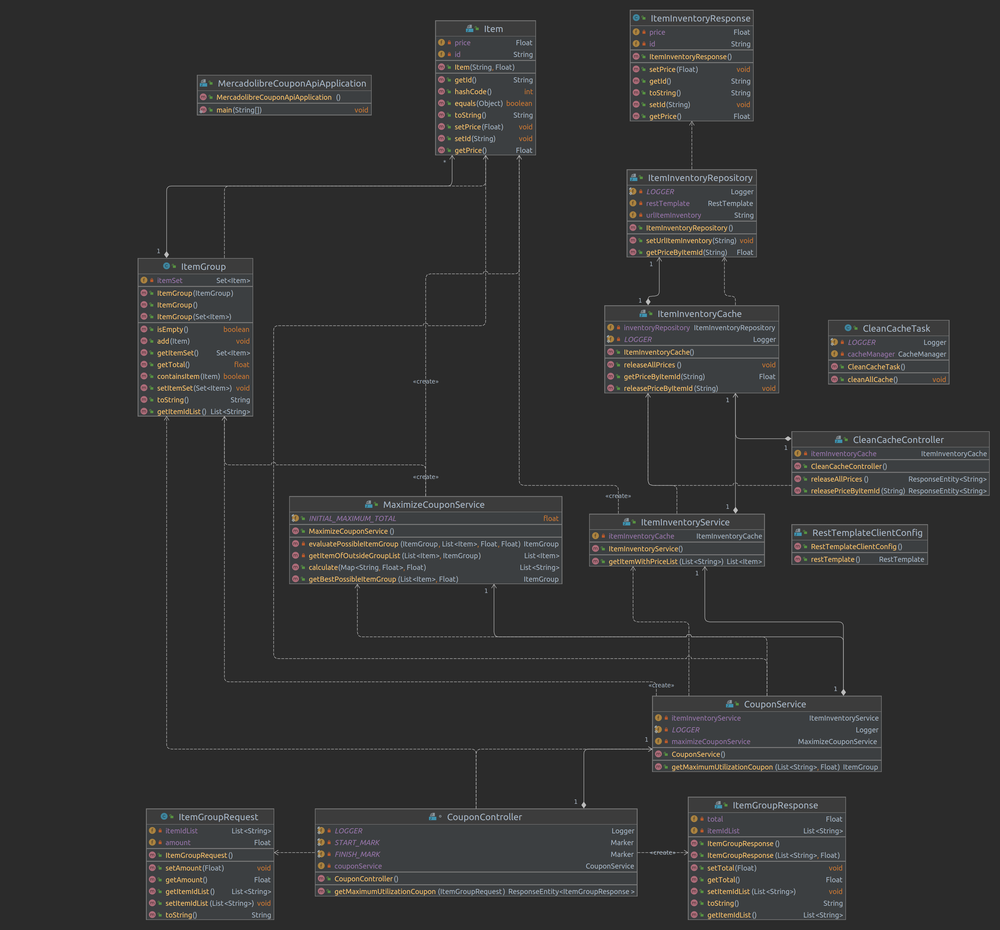

# Análisis del problema y Diseño de solución

En este documento se describe el proceso de analisis del problema y el diseño realizado.

## Funcionalidad de maximización de uso del cupón

En primera instancia se considera el problema de optimización que busca maximizar el total gastado, con limite en el valor total del cupón, por un grupo de items. Donde el item _i_ con precio _pi_ del conjunto de _N_ items, puede estar incluido unicamente una sola vez _xi_. Por lo cual este problema se puede representar mediante la siguiente expresión:

A partir de lo cual se puede asociar este problema como una variante del problema de la mochila (_knapsack problem_ en inglés), del cual se han planteado múltiples algoritmos. Por una parte, teniendo en consideración que los usuarios pueden tener una cantidad significativa de items como favoritos, de acuerdo a lo descrita en el enunciado "... Hay usuarios que tienen miles de items en favoritos..." del requerimiento. Y su vez, la cantidad de items que permite el cupon es significativamente menor en comparación al número de items. Por lo cual, para estos casos el espacio de búsqueda es significativamente mayor al necesario para obtener la solución, y en consecuencia, se plantea el uso de un algoritmo hibrido combinando programación dinamica Top-Down, y ramificación y poda.

Adicionalmente, para la ejecución de este algoritmo se considera inicialmente un procesamiento secuencial en lugar de un procesamiento en múltiples hilos, de acuerdo a lo plateado anteriormente en relación al espacio de búsqueda vs el tamaño de solución. En consecuencia, para es etapa inicial, se considera que los beneficios de emplear procesamiento en paralelo no sobre pasa significativamente sus costos, de acuerdo al __modelo NQ__ propuesto por Oracle al considerar a la suma como operación principal en este algoritmo.

Lo anterior, no platea 

## Diagrama de clases

Se plantean las siguientes clases y en particular para el modelo de dominio:

- Clase __Item__: Modela el item con su precio.
- Clase __ItemGroup__:Modela a un grupo de items (posible solución del problema).

## Consideraciones adicionales

Teniendo en cuenta lo anterior, la mayoría de la latencia del API no corresponderá al cálculo de la solución y en su lugar a la consulta a la interfaz web para obtener el precio de cada item. Por lo cual, se requiere mejorar el tiempo empleado en la consulta de todos los precios de los items, para soportar un gran volumen de consultas. Lo anterior sumado a que los usuarios suelen marcar como favoritos a los mismos items. Se plantea la realización de estas consultas en paralelo y el uso de un cache que almacene el resultado de esta petición para que pueda ser reutilizada en las siguientes peticiones que consideren este mismo item.

Por otra parte, para incrementar el número de peticiones que puede responder el API, se despliega en Google App Engine en un ambiente flexible que permite obtener mejor desempeño de las aplicaciones spring-boot y se definen parametros de auto-escalamiento, de tal forma que aumenten la cantidad de instancias de acuerdo al volumen de peticiones. 
