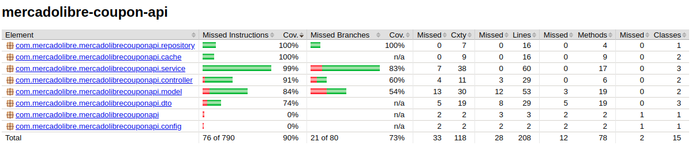
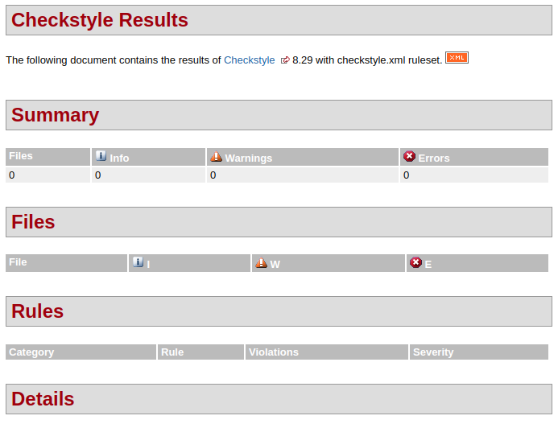
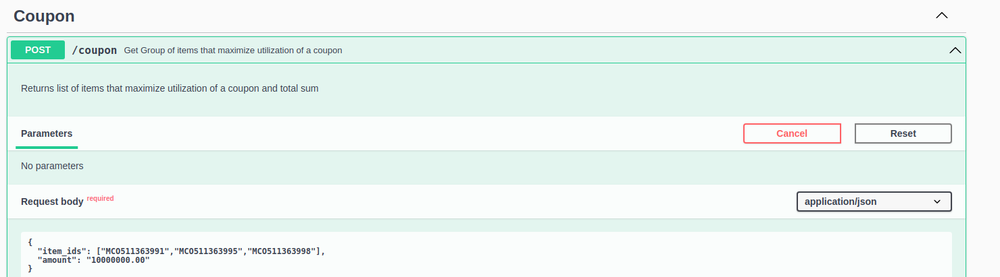
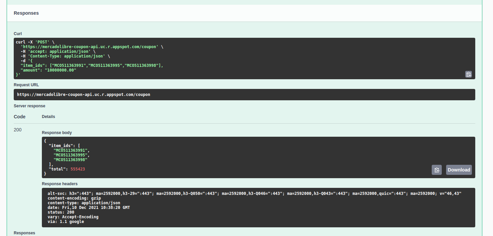

# mercadolibre-coupon-api
API para maximizar el uso de un cupon de Mercado Libre

## Requerimiento

Mercado Libre está implementando un nuevo beneficio para los usuarios que más usan la plataforma con un cupón de cierto
monto gratis que les permitirá comprar tantos items marcados como favoritos que no excedan el monto total. Para esto se
está analizando construir una API que dado una lista de item_id y el monto total pueda darle la lista de items que
maximice el total gastado sin excederlo. 

### Aclaraciones:
- Sólo se puede comprar una unidad por item_id.
- No hay preferencia en la cantidad total de items siempre y cuando gasten el máximo posible.
- El precio puede contener hasta 2 decimales.

## Análisis del problema y Diseño de solución

[En el documento](Design.md) se incluye  el analisis y el diseño realizado.

## Calidad del código

### Validación de _Code_ _Coverage_


### Validación de Estilo


## Instrucciones de ejecución

### Opcion 1 (Empleando Maven):

Para iniciar la aplicación ejecute el siguiente comando:

```bash
./mvnw spring-boot:run
```

### Opcion 2 (Empleando Docker):
- Compilar proyecto:
```bash
./mvnw clean install
```
- Copia archivo JAR en la raiz del proyecto:
```bash
cp ./target/mercadolibre-coupon-api-0.1.0.jar .
```
- Ejecutar docker-compose:
```bash
docker-compose up --build
```

## URL de la API expuesta

Actualmente se encuentra desplegado esta API en Google App Engine en la URL para la consulta POST:
[https://mercadolibre-coupon-api.uc.r.appspot.com/coupon/](https://mercadolibre-coupon-api.uc.r.appspot.com/coupon/)

[Swagger](https://mercadolibre-coupon-api.uc.r.appspot.com/) con descripción del endpoint coupon. Nota: No se incluye la descripción de los endpoint de limpieza de Cache.

### Uso del endpoint __coupon__
Para realizar la prueba de esta API, se pueden emplear herramientas como PostMan o directamente desde [Swagger](https://mercadolibre-coupon-api.uc.r.appspot.com/) como se observa a continuación:

### Petición


### Respuesta


### Limpieza de Cache
- Limpieza de cache por itemId: http://localhost:8080/cleanCache/price/__ItemId__
- Limpieza de cache de todos los items: http://localhost:8080/cleanCache/allPrices

## Posibles mejoras futuras

- [ ] Habilitar metricas de latencia mediante actuator y prometeus.
- [ ] Modificar para convertir en API reactiva empleando Spring WebFlux and WebClient.
- [ ] Emplear cache en el cálculo de la solución para grupo de items de tamaño significativo.
- [ ] Emplear memcache en Google App Engine para compartir el cache entre las instancias.
- [ ] Emplear Github Actions para generar release y desplegar a Google App Engine automaticamente posterior al merge a master.